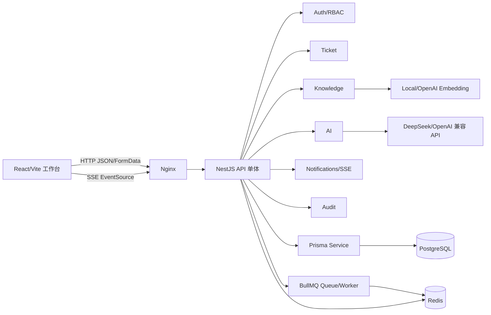

# 当前项目架构设计报告

> 分析日期：2026-09-08
>
> 分析范围：apps/frontend、apps/backend、Prisma schema/migrations、Docker Compose、CI 配置
>
> 工作模式：mode=dev（只读架构分析 + 报告文件）
>
> 证据边界：本报告基于当前工作区源码、配置和测试结构的静态分析；没有把本地启动、真实数据库、真实 Redis、真实 AI/Embedding 服务或生产部署结果推断为已验证事实。

## 一、结论先行

项目采用适合学习和中小规模内部工具的全栈单体架构：

- 前端是 React 19 + Vite + React Router + Ant Design，按页面和工作台组件组织。
- 后端是 NestJS 11 模块化单体，HTTP API、认证授权、审计、AI、知识库和通知运行在同一个 Node.js 进程中。
- PostgreSQL 是业务事实源，Prisma 负责数据访问和迁移。
- Redis 同时承担缓存、固定窗口限流和 BullMQ 队列。
- 知识库采用“文档 → 分片 → embedding → 内存余弦排序”的轻量 RAG。
- AI 通过 provider 接口切换 mock 与 DeepSeek，包含重试、JSON 输出约束、结果校验、降级和成本记录。
- 通知采用数据库持久化 + 进程内 RxJS Subject + SSE。
- Docker Compose 组合 PostgreSQL、Redis、后端和 Nginx 前端；GitHub Actions 负责 lint、build、test 和镜像构建 smoke test。

整体优点是模块边界清楚、技术选型一致、降级路径明确。主要问题集中在生产可靠性和安全边界：公开注册默认获得 agent 角色、JWT 缺失密钥时存在硬编码回退、审计回放链条不完整、知识搜索随数据量线性增长、SSE 只在单进程内传播、敏感 token 放在 URL、前端状态容易陈旧，以及部分文档已经落后于当前代码。

## 二、系统拓扑与主要数据流



### 2.1 启动与请求入口

后端入口在 apps/backend/src/main.ts:6-24：

1. 创建 Nest 应用。
2. 设置 /api 全局前缀。
3. 启用全局 ValidationPipe，使用 whitelist、forbidNonWhitelisted 和 transform。
4. 注册统一 HTTP 异常过滤器和 Swagger。
5. 根据 FRONTEND_ORIGIN 配置 CORS。
6. 监听 PORT。

AppModule 在 apps/backend/src/app.module.ts:7-35 汇总 Redis、Prisma、Embedding、Audit、Auth、Tickets、Notifications、Knowledge 和 AI 模块，并注册全局 RedisRateLimitGuard。这说明后端是模块化单体，而不是多个独立服务。

前端入口链路为 StrictMode → BrowserRouter → AntdApp → AuthProvider → App，见 apps/frontend/src/main.tsx:10-19。路由在 apps/frontend/src/App.tsx:116-139 定义，公开路由是 /login 与 /submit，其余路由由 ProtectedRoute 包裹。

### 2.2 认证、授权与响应过滤

认证流程如下：

```
Authorization: Bearer accessToken
  → JwtAuthGuard
  → JwtStrategy.validate()
  → Prisma 查询 User
  → RolesGuard 检查 @Roles()
  → Controller
```

- JwtStrategy 每次按 JWT 的 sub 查 User（apps/backend/src/auth/jwt.strategy.ts:9-28）。
- AuthService 使用 bcrypt 校验密码；refresh token 以哈希形式落库，并在刷新时通过 updateMany(... revokedAt: null) 做轮换和并发重放保护（apps/backend/src/auth/auth.service.ts:25-47,83-120）。
- RolesGuard 根据方法或控制器上的 @Roles() 做粗粒度 RBAC（apps/backend/src/auth/roles.guard.ts:17-38）。
- FieldPermissionsInterceptor 只对带 @FieldPermissions() 的 GET 响应做递归字段过滤（apps/backend/src/auth/field-permissions.interceptor.ts:16-71），字段矩阵定义在 permission-matrix.ts:3-33。

前端 getRolePermissions() 只负责 UX 展示和按钮隐藏，真正安全边界仍在后端；apps/frontend/README.md:68-78 也明确了这一点。

### 2.3 工单领域链路

工单接口包括 GET /api/tickets、GET /api/tickets/:id、POST /api/tickets、POST /api/tickets/public、PATCH /api/tickets/:id/status 和 POST /api/tickets/:id/replay，控制器见 apps/backend/src/tickets/tickets.controller.ts:36-104。

TicketsService 直接使用 Prisma 完成 CRUD（tickets.service.ts:22-146）：

- 创建工单时同时创建一条 REQUESTER 消息。
- 更新状态时同时追加一条 SYSTEM 消息。
- 公开建单写入 source=public 和可选的提交人联系方式。
- 公开建单后异步调用 NotificationsService.push()，不阻塞 HTTP 响应（tickets.service.ts:81-113）。

Prisma 中 Ticket 与 TicketMessage、User、AiLog、Notification 形成关系，状态、优先级、更新时间等字段有索引；schema 见 apps/backend/prisma/schema.prisma:95-136。

### 2.4 知识库与 RAG

知识库流程：

```
POST /knowledge 或 /knowledge/upload
  → 创建 PROCESSING 文档
  → 删除列表缓存
  → Redis 可用：BullMQ 入队
  → Redis 不可用：同步 indexDocument()
  → Markdown 归一化
  → 按段落分片（上限 480 字符）
  → Embedding
  → 事务删除旧 chunks、创建新 chunks、标记 INDEXED
  → 删除列表缓存
```

主要证据：

- KnowledgeService.create/upload/scheduleIndexing：apps/backend/src/knowledge/knowledge.service.ts:86-160
- 分片和 citation 提取：apps/backend/src/knowledge/knowledge-indexing.ts:18-44,65-150
- 索引事务和失败状态：apps/backend/src/jobs/knowledge-indexing.service.ts:24-69
- BullMQ 重试 3 次、指数退避、Worker 并发默认 2：apps/backend/src/jobs/knowledge-indexing.queue.ts:11-37、knowledge-indexing.worker.ts:22-56

Embedding 通过 provider 工厂切换：local 为 16 维确定性哈希，openai 默认 1536 维并调用 OpenAI 兼容 /embeddings API。

搜索当前由 KnowledgeService.search() 把所有已索引 chunk 读入 Node 内存，逐个计算 cosine similarity，再排序截断（knowledge.service.ts:53-84）。实现简单但复杂度随 chunk 数量线性增长，没有 pgvector 或 ANN 索引。

### 2.5 AI provider、RAG 与成本监控

AI 控制器提供回复建议、摘要和 AI 日志查询。AiService 先读取工单；回复建议场景再调用知识库向量搜索，取最多 5 个结果，把命中文档内容拼入 prompt；之后调用注入的 AI_PROVIDER，并把结果、引用、操作者、token 用量和估算成本写入 AiLog（apps/backend/src/ai/ai.service.ts:23-131）。

provider 设计有清晰扩展点：

- AiProvider 接口统一回复建议和摘要能力（ai-provider.interface.ts:1-43）。
- AI_PROVIDER=mock|deepseek 由工厂选择（ai-provider.factory.ts:5-15）。
- DeepSeek provider 使用 JSON mode、30 秒超时、最多 3 次调用、输出长度/置信度/禁词/紧急工单引用校验（deepseek-ai.provider.ts:167-214,300-417）。
- DeepSeek 失败后，AiService.callWithFallback() 返回固定 mock 文本，仍写入 AiLog（ai.service.ts:152-177）。

当前 API 返回没有明确标识真实模型结果和降级结果，调用方可能把降级文本当成真实模型输出。

### 2.6 审计、回放与操作记录

审计通过 @Auditable() + AuditInterceptor 实现：

```
HTTP 请求成功 → AuditInterceptor.tap()
  → AuditService.log() → 内存 buffer
  → 每 5 秒或达到 50 条 → Prisma.auditLog.createMany()
```

AuditInterceptor 只记录用户、动作、资源、资源 ID、方法和路径（apps/backend/src/audit/audit.interceptor.ts:36-77）；AuditService 批量写入并在模块销毁时尝试 flush（audit.service.ts:9-69）。

工单回放存在事实链缺口：

1. 审计拦截器默认 metadata 是空对象，没有记录字段变更。
2. TicketsService.updateStatus() 没有把状态前后值写进 audit metadata。
3. TicketReplayService 以当前 Ticket 作为初始状态，再应用过去事件（ticket-replay.service.ts:22-80）。
4. 回放到历史时间点时，当前字段可能残留，状态变更也没有可重放的 metadata.changes。

因此当前 replay 更接近基于不完整审计事件的近似计算，还不是可靠的事件溯源或历史快照系统。

### 2.7 通知与 SSE

Notification 表保存 admin/agent 的持久化通知；NotificationsService.userStreams 用 Map<userId, Subject> 保存当前 Node 进程内的 SSE 流（apps/backend/src/notifications/notifications.service.ts:7-58）。前端 NotificationContext 启动时加载历史通知，再用 EventSource 连接 stream（apps/frontend/src/notifications/NotificationContext.tsx:25-84）。

单实例中模型简单有效，但：

- 多后端实例之间没有 Redis Pub/Sub，通知只会送到持有连接的进程。
- SSE token 通过 ?authorization=Bearer ... 放在 URL，可能进入浏览器历史、代理和访问日志。
- 前端没有断线补偿、事件去重和退避策略，历史加载与实时事件并行时可能重复。

## 三、数据模型评价

当前 schema 以关系型模型为核心，领域划分直观：

| 模型 | 作用 | 关键关系/索引 |
|---|---|---|
| User | 用户、角色、登录主体 | email 唯一；关联工单、refresh token、审计、AI 日志、通知 |
| RefreshToken | 可撤销会话 | userId、expiresAt、revokedAt 索引 |
| Ticket | 工单主实体 | status、priority、updatedAt 索引；关联消息和 AI 日志 |
| TicketMessage | 工单时间线 | ticketId + createdAt 索引 |
| KnowledgeDocument | 文档元数据和索引状态 | status、createdAt 索引 |
| KnowledgeChunk | 文档分片、偏移、embedding | documentId + position 唯一 |
| AiLog | AI 结果、引用、token 和成本 | ticketId、type、createdAt、model + createdAt |
| AuditLog | 操作轨迹 | actor、action、resource、createdAt |
| Notification | 持久化通知 | userId + isRead、userId + createdAt |

embedding 仍需要 provider/model/dimensions/indexVersion 等契约字段；审计需要可重放的 before/after 或结构化 patch。

## 四、前端架构评价

前端由 api/client.ts、auth、components/workbench、pages 和 lib/workbench.ts 组成。API 客户端集中类型、JSON/FormData 请求和 JWT 自动刷新；第一次 401 触发共享 refreshSessionPromise，刷新成功后重试原请求（apps/frontend/src/api/client.ts:265-333）。

主要问题：

- 页面状态大多放在各自 useState/useEffect 中，没有统一 query cache；跨页面切换后数据可能陈旧或重复加载。
- 请求没有 AbortController、超时和竞态保护，快速切换工单或搜索词时旧响应可能覆盖新状态。
- AuthContext.restoreSession() 把所有恢复失败都当成匿名并清空 token（AuthContext.tsx:19-31），短暂网络故障可能造成不必要登出。
- WorkbenchLayout 的 audit 菜单没有和权限完全同步，非 admin 用户仍可能看到入口，页面再显示无权提示。
- HomePage.tsx 仍保留旧的聚合工作台逻辑，但当前路由使用 DashboardPage、TicketsPage 等；前端 README 也仍描述旧的单一 HomePage 路由。
- main.tsx 与 App.tsx 各包一层 AntdApp，存在重复上下文。
- 外层通配 path=* 再嵌套一套 Routes，结构比单一嵌套路由复杂。

## 五、风险优先级

### P0：认证边界

公开注册无 Guard，新用户在 AuthService.register() 中创建后使用 schema 默认 AGENT。该角色可以读取全量工单、创建/上传知识文档、调用 AI 和读取成本日志。公网部署时任何人都可能自助获得内部 agent 权限。

AuthModule 和 JwtStrategy 在缺少 JWT_SECRET 时回退 local-development-jwt-secret。生产配置漏设时，签名边界会退化为公开可猜的固定值。

### P1：审计可靠性和回放正确性

AuditService.flushNow() 写库前先移出 buffer，写库失败只记录 warn，不重试也不持久化失败批次，审计事件可能丢失。公开工单没有 req.user，当前拦截器也不会记录公开提交操作。replay 依赖不存在的 metadata.changes，不能可靠重建过去状态。

### P1：知识搜索扩展性与 embedding 一致性

全量读取 chunk 并在 Node 进程排序，数据增长后会消耗内存和 CPU。切换 local 16 维与 OpenAI 1536 维 provider 后，旧数据和新数据可能混用；cosine 实现按较短维度静默截断，可能产生错误结果。

### P1：AI 成本、隐私和可信输出

回复建议把命中文档的完整 content 拼入 prompt，而不是只拼命中 chunk，可能造成 prompt 膨胀和成本升高。DeepSeek HTTP 错误日志包含完整 response body（deepseek-ai.provider.ts:396-401）。降级结果和真实模型结果写入同一类 AiLog，产品层难以区分证据等级。

### P1：通知多实例和断线可靠性

进程内 Subject 只能覆盖单实例；公开建单通知采用 fire-and-forget，进程异常时可能丢失推送或只生成部分通知。SSE query bearer 还需要配套代理日志脱敏。

### P1：前端 token 与状态一致性

access/refresh token 保存在 localStorage（api/client.ts:335-355），同源脚本一旦被注入即可读取；SSE 又把 access token 放进 query string。统一请求取消、query cache 和 stale response 防护尚未建立。

### P2：Redis fail-open 与文档漂移

Redis 访问异常会被吞掉并返回 undefined；限流器在此情况下放行请求。前端 README 的路由和测试数量已经落后于代码，根 README 还混合当前架构、历史报告和未来计划。

## 六、优势与适用范围

1. 模块边界清楚：Auth、Tickets、Knowledge、AI、Audit、Notifications、Embedding 和 Jobs 都有独立 module/controller/service。
2. Provider 可插拔：AI 和 Embedding 默认 mock/local，测试和演示不依赖付费外部服务。
3. 输入契约严格：ValidationPipe 拒绝未声明字段，DTO 负责格式和长度校验，错误响应统一。
4. 会话轮换设计完整：refresh token 不明文落库，支持过期、撤销和轮换。
5. 知识索引具有事务边界：旧分片删除、新分片创建和文档状态更新在同一 Prisma 事务内完成。
6. AI 已有 JSON 输出、重试、禁词、置信度阈值和紧急工单引用校验。
7. Docker 多阶段构建、Nginx 反向代理、Compose 健康检查和 CI 门禁适合单机交付。

当前最适合学习、演示、单团队内部工具、单实例或低并发部署。数据量和并发增长前，不建议直接拆微服务；应先稳定权限、事件、索引和通知事实边界。

## 七、建议的演进路线

### 阶段 0：立即修复安全边界

- 删除 JWT 硬编码回退，生产启动缺少 JWT_SECRET 直接失败。
- 收紧 /auth/register，改为邀请、管理员审批或低权限待激活。
- SSE 不再使用长期 access token query 参数。
- 外部 AI 错误体日志截断、脱敏。
- 在 AiLog/响应中区分真实 provider、mock 和 fallback。

### 阶段 1：补齐一致性和可观测性

- 为 Ticket 状态变更增加 before、after、actor、requestId、createdAt 事件。
- 审计批量写入失败时重试或进入持久化失败队列。
- 公开提交增加匿名/系统 actor 记录。
- 为通知、索引、AI fallback 增加指标、结构化日志和告警。
- 增加 replay、refresh 并发、SSE 断线、队列失败和权限拒绝测试。

### 阶段 2：解决数据规模和多实例问题

- 使用 pgvector/ANN，或将检索抽成独立服务。
- 为 embedding 保存 provider、model、dimensions、version，并提供重建任务。
- 引入 Redis Pub/Sub 或消息总线广播通知。
- Notification 作为补偿事实源，SSE 按游标补发。
- 将知识索引 Worker 从 API 进程中独立部署。

### 阶段 3：前端状态和契约治理

- 使用统一请求缓存层管理 tickets、knowledge、AI logs 和通知。
- 所有可取消请求使用 AbortController，并防止旧响应覆盖新状态。
- 统一路由配置和错误边界，删除旧 HomePage 聚合逻辑或明确其用途。
- 用 OpenAPI 生成前端类型，减少手工类型漂移。
- 更新 README，分开维护当前架构、运行限制和历史报告。

## 八、验证记录

本次执行了：

- git status --short、git branch --show-current、git log -5 --oneline
- 项目文件与目录扫描
- 根 README、前后端 README、package.json、pnpm workspace、Docker Compose、Dockerfile、Nginx 和 CI 配置读取
- NestJS modules/controllers/services、Prisma schema、前端路由/API/Auth/Notification 代码读取
- 现有后端 E2E 测试和前端测试文件结构读取
- cmp -s AGENTS.md CLAUDE.md，结果一致

本次没有启动 PostgreSQL/Redis，没有运行前后端 dev server，没有调用真实 AI/Embedding 服务，也没有执行完整 lint/build/test 门禁。因此性能、跨实例 SSE、真实外部 API 行为和生产安全结论属于源码与配置层面的风险判断，不能替代运行态或生产验证。

## 九、最终判断

当前架构方向合理：模块化单体承载业务，provider 抽象隔离 AI/Embedding，PostgreSQL 保存事实，Redis/BullMQ 提供缓存与异步能力，SSE 提供轻量通知。它已经具备继续演进的清晰落点。

进入更可靠的生产形态时，优先顺序应是先收紧认证和密钥边界，再修复审计/回放与通知可靠性，随后处理向量检索规模化和前端状态一致性。微服务拆分应放在这些事实、事件和权限边界稳定之后。
